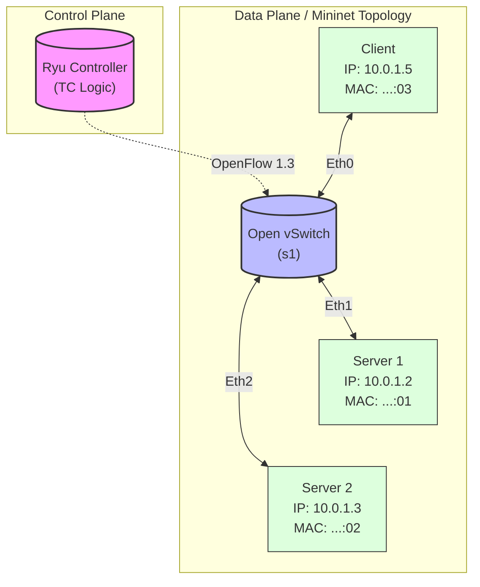

# Ryu-Based SDN Traffic Control

**Xi'an Jiaotong-Liverpool University (XJTLU)**

**CAN201 Computer Networking - Academic Year 2023**

**Course Project 2 (CW2) - Group 44**

**Dec 16, 2023**

---

### 👥 Authors

* **[Tianxin Zhao](https://github.com/TianxinZhao)**
* **[Peiyu Hu](https://github.com/hupeiyu21)**
* **[Tan Chen](https://github.com/constantian-chen)**
* **Dingjie Cao**
* **Heng Liu**

---

### 📖 Project Overview

This is the implementation of Course Project 2 (CW2) for CAN201, a Year 2 undergraduate course at Xi'an Jiaotong-Liverpool University (XJTLU). This project accounts for 12.5% of the total course marks.
The requirements can be found in [Specification](Specification/CAN201%20-%20CW%20Part%20II.pdf). The repository for Course Project 1 (CW1) can be found  [here](https://github.com/TianxinZhao/XJTLU_CAN201_CW1).

Relatively speaking, this is a straightforward project that uses a Software-Defined Networking (SDN) framework based on the **Ryu** Controller to perform transparent traffic redirection. The estimated coding workload is approximately **1-2.5 hours**. Please note that the code is assessed primarily on correctness, whereas the Project Report carries a significant weight in the final grading; therefore, it is highly recommended to allocate the majority of your time to drafting the report.

**Components:**

* **`networkTopo.py`**: Defines the network topology.
* **`ryu_forward.py`**: Basic Layer 2 learning switch.
* **`ryu_redirect.py`**: Transparent TCP traffic redirection.
* **`server.py` & `client.py`**: Provided test tools.

**Architecture:**


-----

### ⚡ Usage

#### 1. Setup 

```Bash
# Install dependencies
sudo apt-get update
sudo apt-get install -y mininet python3-pip openvswitch-testcontroller
pip3 install ryu eventlet

# Clone the repository 
git clone https://github.com/TianxinZhao/Ryu-Based-SDN-Traffic-Control.git
cd Ryu-Based-SDN-Traffic-Control
```

#### 2. Running the Simulation

You will need **two separate terminal windows** to run the controller and the topology simultaneously.

**Terminal 1:**

```bash
# Option A: Basic L2 Forwarding (Task 4)
ryu-manager ryu_forward.py

# Option B: Transparent Traffic Redirection (Task 5)
ryu-manager ryu_redirect.py
```

**Terminal 2:** 

Start the Mininet network topology (ensure the controller is running first), then verify connectivity inside the Mininet CLI

```Bash
sudo python3 networkTopo.py

# Verify reachability between all hosts
mininet> pingall

# Test specific TCP connections (opens host terminals)
mininet> xterm client server_1 server_2
```

-----

### 📄 License

This project is licensed under the GPL-3.0. You are free to copy and distribute the code; however, please note that the source code has been submitted to the course plagiarism detection database. **Please do not directly copy code from this repository for your own coursework.**